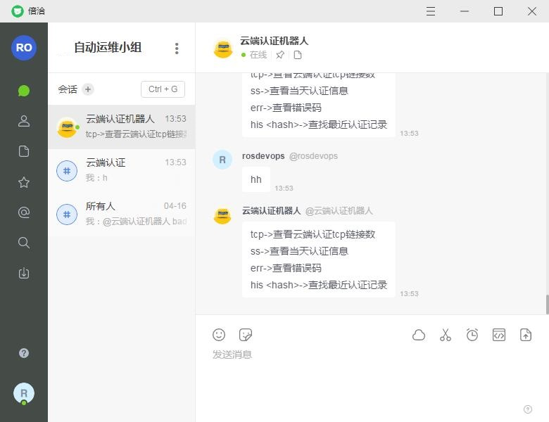

# chatops-examples
基于bearychat的chatops实践整理. 涉及概念:

- bearychat是一个聊天工具
- hubot是github开源的机器人

##  背景

下面以我工作中需要登录到线上机器处理的一些琐事为例,列举一下日常运维事情.

环境组成:

- 3台mongo
- 2台服务器

日常操作:

- 登录到两台机器查看tcp链接数是否正常
- 统计数据,看今天一些请求是否有异常
- 根据输入从日志里查询一些信息
- 其他操作

每次都要登录到机器,然后执行一系列操作.  尤其是机器多的时候总是来回在机器上敲命令,非常的慢. 而且很难去记录历史输出.

## Chatops

 使用bearychat+hubot搭建了一个chatops方式. 将一些操作代理给机器人去做.



对机器人输入:hh,可以显示当前支持的一些动作，输入相应的命令,机器人回去执行，然后将输出返回回来. 这样带来的好处是:

1. 省去在服务器上去手动执行一些列运维命令
2. 将操作集中化, 比如要在很多机器执行很多操作, 现在集中到一个聊天窗口,省得来回切换机器和命令.
3. 提升效率, 更好的运维. 

表面看就只是将以前手动操作封装起来交给机器人去执行, 手动也能完成. 但从流程和效率上, 更是一种新的运维方式. 更加规范、高效. 

另外http://bearyinnovative.com/salon-chatops/也给出了一些优点:

- 公开透明。所有的工作消息都在同一个聊天平台中沉淀并公开给所有相关成员，消除沟通壁垒，工作历史有迹可循，团队合作更加顺畅。
- 上下文共享。减少因工作台切换等对消息的截断，保证消息的完整性，让工作承接有序，各角色，各工具都成为完成工作流中的一环，打造真正流畅的工作体验。
- 移动友好。只需要在前台与预设好的机器人对话即可完成与后台工具、系统的交互，在移动环境下无需再与众多复杂的工具直接对接，大大提升移动办公的可行性。
- DevOps 文化打造。用与机器人对话这种简单的方式降低 DevOps 的接受门槛，让这种自动化办公的理念更容易的扩展到团队的每一个角落。


## 实践

下面来看如何搭建一个bearychat机器人.

####  创建hubot机器人

机器人管理--->添加机器人--->自定义-->hubot-->添加

创建好的机器人有一个Hubot Token字段


#### 部署 Hubot

hubot-bearychat是一个将bearychat与hubot对接的适配器.

如果nodejs还没安装,先要安装:
```bash
https://www.metachris.com/2017/01/how-to-install-nodejs-6-lts-on-ubuntu-and-centos/

# Install Node.js 6.x repository
curl -sL https://rpm.nodesource.com/setup_6.x | bash -

# Install Node.js and npm
yum install nodejs
```

查看安装步骤(https://github.com/bearyinnovative/hubot-bearychat/blob/master/README_CN.md):

- `npm install -g hubot coffee-script yo generator-hubot`

- `mkdir -p /home/hubot`

- `cd /home/hubot`

- `yo hubot`

- `npm install hubot-bearychat --save` 

- 配置环境变量:

  ```bash
  $ export HUBOT_BEARYCHAT_TOKENS=token-token-token-here
  $ export HUBOT_BEARYCHAT_MODE=rtm
  ```

  ​

- `/home/hubot/bin/hubot -a bearychat`


注意: 

- 可以在npm后面加上`--registry=https://registry.npm.taobao.org`加速


- 如果是root用户,执行`yo hubot`可能会出错. 可以随便使用`adduser`创建一个用户,比如我这里叫hubot，然后切换到这个用户执行这个命令.

- 由于会使用环境变量,所以可以将下面环境变量加入到当前用户bashrc里:

  ```bash
  $ export HUBOT_BEARYCHAT_TOKENS=token-token-token-here
  $ export HUBOT_BEARYCHAT_MODE=rtm
  ```

  如果是用的supervisor管理,配置如下:

  ```bash
  [program:hubot]
  command=/home/hubot/bin/hubot -a bearychat
  directory=/home/hubot
  autostart=true
  autorestart=true
  stopasgroup=true
  killasgroup=true
  startretries=3
  environment=HUBOT_BEARYCHAT_TOKENS="token-token-token-here",HUBOT_BEARYCHAT_MODE="rtm"
  stderr_logfile=/home/hubot/hubot.err.log
  stderr_logfile_maxbytes=1MB
  stdout_logfile=/home/hubot/hubot.out.log
  stdout_logfile_maxbytes=1MB
  user=hubot

  ```


定义一些机器人执行的命令. 

- `/home/hubot/scripts`

- 创建一个文件`command.coffee`

  可以参考https://github.com/bearyinnovative/hubot-bearychat/blob/master/example/scripts/example.coffee

  ```coffeescript
  module.exports = (robot) ->
    robot.hear /badger/i, (res) ->
       res.send "Badgers? BADGERS? WE DON'T NEED NO STINKIN BADGERS"
  ```


#### 聊天

在`bearychat`里就能找到机器人,和机器人聊天. 给机器人发送:`badger`,机器人将恢复:`Badgers? BADGERS? WE DON'T NEED NO STINKIN BADGERS`


## 扩展

如果我们需要调用其他脚本，比如执行python脚本等. 由于有权限等问题. 比如我需要调用fabric去执行一些远程主机操作,就遇到一些权限问题. 所以这里采取这样的办法:

- 搭建一个rest api服务,通过http发送命令去执行.
- hubot调用rest api去实际的控制需要执行的命令.

例如:

```coffeescript
module.exports = (robot) ->
  robot.respond /tcp/i, (msg) ->
    robot.http("http://127.0.0.1:5000/tcp")
      .get() (err, response, body) ->
        console.log('tcp err:' + err)
        msg.send(body)
```


